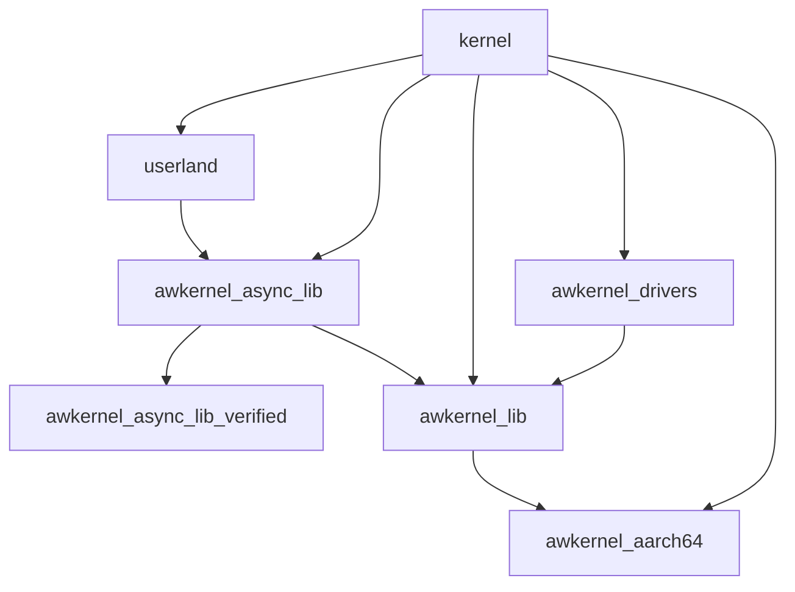

# Autoware Kernel

Autoware kernel is a safe and realtime operating system supporting
isolated zero-copy communications written in Rust.

## Progress

- [x] Zero-copy communications
  - [x] Publish and subscribe
  - [x] Service
  - [x] Action
- [x] Channels
  - [x] Bounded channel
  - [x] Unbounded channel
  - [x] Session-type based channel
- [x] Memory space isolation
- [ ] Timer interrupts
  - [x] Raspberry Pi
  - [x] AArch64
  - [ ] x86_64
- [ ] Measurement
- [ ] Power Management
  - [ ] Shutdown
  - [ ] Reboot
- [ ] Schedulers
  - [x] FIFO scheduler
  - [ ] Round robin scheduler
  - [ ] EDF scheduler
  - [ ] DAG scheduler
- [ ] Memory allocators
  - [x] O(1) memory allocator
  - [x] DMA pool
  - [ ] NUMA aware memory allocator
- Networking
  - [x] IPv4
  - [x] IPv6
  - [x] UDP
  - [x] TCP
  - [ ] VLAN
  - [ ] IP multicast
  - [ ] Offloading
    - [ ] TSO
    - [ ] IPv4 header checksum
    - [ ] UDP checksum
    - [ ] TCP checksum
    - [ ] VLAN hardware tagging
- Network controllers
  - [x] Intel Gb Ethernet Controller (e1000 Series)
  - [ ] Intel 2.5Gb Ethernet Controller (I225/I226 series)
  - [ ] Intel 10Gb Ethernet Controller (X520 Series)
  - [ ] Intel 40Gb Ethernet Controller (X710 Series)
  - [ ] genet for Raspberry Pi
- [ ] Block devices
  - [ ] NVMe
  - [ ] AHCI
- [ ] Diagnostics
- [ ] XHCI
- [ ] File systems
  - [ ] FAT32
  - [ ] Journaling file system

## Dependencies

```text
$ sudo apt install clang qemu-system-arm qemu-system-x86 qemu-system-misc
$ rustup toolchain install nightly-2024-02-12
$ rustup default nightly-2024-02-12
$ rustup component add rust-src llvm-tools-preview
$ rustup target add x86_64-unknown-none aarch64-unknown-none riscv32imac-unknown-none-elf
$ cargo install cargo-binutils
```

## Crates

- [kernel](./kernel/)
  - boot code
  - initialization
    - virtual memory
    - heap memory
    - stack memory
    - devices (UART, etc)
- [awkernel_lib](./awkernel_lib/)
  - library used by both [kernel](./kernel/) and [awkernel_async_lib](./awkernel_async_lib/)
- [awkernel_async_lib](./awkernel_async_lib/)
  - asynchronous library for no_std
- [awkernel_async_lib_verified](./awkernel_async_lib_verified/)
  - verified library for awkernel_async_lib
  - pure Rust (no dependencies on external functions and no inline assembly)
- [awkernel_drivers](./awkernel_drivers/)
- [awkernel_aarch64](./awkernel_aarch64/)
- [userland](./userland/)
- applications
  - [awkernel_shell](./applications/awkernel_shell/)



Applications can use `awkernel_async_lib`, `awkernel_lib`, and `awkernel_drivers`.

---

## x86_64

### Compile

Debug build.

```text
$ make x86_64
```

Release build.

```text
$ make x86_64 RELEASE=1
```

If you want to use UEFI, make `x86_64_uefi.img` as follows.

```text
$ make x86_64_uefi.img
```

### Boot

```text
$ make qemu-x86_64
```

### GDB

```text
$ make debug-x86_64
$ make gdb-x86_64
```

---

## AArch64 Qemu Virt

### Compile

Debug build.

```text
$ make aarch64 BSP=aarch64_virt
```

Release build.

```text
$ make aarch64 BSP=aarch64_virt RELEASE=1
```

### Boot

```text
$ make qemu-aarch64_virt
```

### GDB

```text
$ make debug-aarch64_virt
$ make gdb-aarch64_virt
```

---

## Raspberry Pi 3 (AArch64, Qemu) or Raspberry Pi Zero 2 W

### Compile

Release build.
`RELEASE=1` must be used for actual devices.

```text
$ make aarch64 BSP=raspi3 RELEASE=1
```

Debug build.

```text
$ make aarch64 BSP=raspi3
```

### Boot

```text
$ make qemu-raspi3
```

### GDB

```text
$ make debug-raspi3
$ make gdb-raspi3
```

---

## Raspberry Pi 4 (AArch64)

### Compile

Specify `Release=1`.

```text
$ make aarch64 BSP=raspi4 RELEASE=1
```

### Boot

- Serial
  - port: GPIO 14 (Tx) and 15 (Rx)
  - 8N1: eight data bits, no parity, one stop bit
  - Speed: 115200

---

## RISC-V (32bit, Qemu)

### Compile

Debug build.

```text
$ make riscv32
```

Release build.

```text
$ make riscv32 RELEASE=1
```

### Boot

```text
$ make qemu-riscv32
```

---

## Linux / macOS

### Compile

Debug build.

```text
$ make std
```

Release build.

```text
$ make std RELEASE=1
```

### Boot

Debug build.

```text
$ make run-std
```

Release build.

```text
$ make run-std RELEASE=1
```

## Qemu Monitor

```text
$ make qemu-raspi3
$ telnet localhost 5556
```
