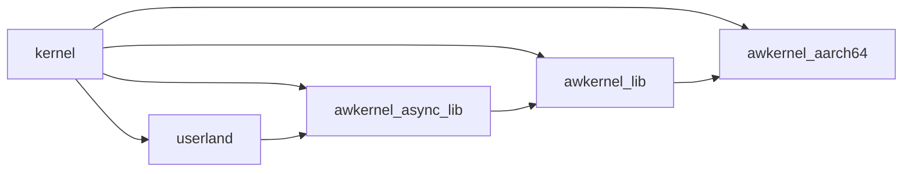

# Autoware Kernel

Autoware kernel is a safe and realtime operating system supporting
isolated zero-copy communications written in Rust.

## Progress

- [x] Zero-copy communication
  - [x] Publish and subscribe
  - [x] Service
  - [ ] Action
- [ ] Isolation
  - [x] Memory space isolation
  - [ ] Temporal isolation
- [ ] Scheduling
  - [x] Round robin scheduler
  - [ ] DAG scheduler
- [x] O(1) memory allocator
- [ ] Cokernel
- [ ] TEE
  - [ ] TrustZone

## Dependencies

```text
$ sudo apt install clang qemu-system-arm qemu-system-x86 qemu-system-misc
$ rustup toolchain install nightly
$ rustup default nightly
$ rustup component add rust-src llvm-tools-preview
$ rustup target add x86_64-unknown-none aarch64-unknown-none riscv32imac-unknown-none-elf
$ cargo install cargo-binutils
```

## Crates

- [kernel](./kernel/)
  - boot code
  - initialization
    - virtual memory
    - heap memory
    - stack memory
    - devices (UART, etc)
- [awkernel_lib](./awkernel_lib/)
  - library used by both [kernel](./kernel/) and [awkernel_lib](./awkernel_lib/)
- [awkernel_async_lib](./awkernel_async_lib/)
  - asynchronous library for no_std
- [awkernel_drivers](./awkernel_drivers/)
- [awkernel_aarch64](./awkernel_aarch64/)
- [userland](./userland/)



## Compile

### x86_64

Debug build.

```text
$ make x86_64
```

Release build.

```text
$ make x86_64 RELEASE=1
```

If you want to use UEFI, make `x86_64_uefi.img` as follows.

```text
$ make x86_64_uefi.img
```

### Raspberry Pi 3 (AArch64)

Debug build.

```text
$ make raspi
```

Release build.

```text
$ make raspi RELEASE=1
```

### Raspberry Pi 4 (AArch64)

Debug build.

```text
$ make raspi BSP=raspi4
```

Release build.

```text
$ make raspi BSP=raspi4 RELEASE=1
```

### RISC-V (32bit)

```text
$ make riscv32
```

### Linux / macOS

```text
$ make std
```

Release build.

```text
$ make std RELEASE=1
```

## Boot

### x86\_64

```text
$ make qemu-x86_64
```

### Raspberry Pi 3 (AArch64)

```text
$ make qemu-raspi3
```

### Raspberry Pi 4 (AArch64)

- Serial
  - port: GPIO 14 (Tx) and 15 (Rx)
  - 8N1: eight data bits, no parity, one stop bit
  - Speed: 115200

### RISC-V (32bit)

```text
$ make run-riscv32
```

### Linux / macOS

```text
$ make run-std
```

Release build.

```text
$ make run-std RELEASE=1
```

## Qemu Monitor

```text
$ make qemu-raspi3
$ telnet localhost 5556
```

## GDB

### Raspberry Pi 3 (AArch64)

```text
$ make debug-raspi3
$ make gdb-raspi3
```

### x86\_64

```text
$ make debug-x86_64
$ make gdb-x86_64
```
