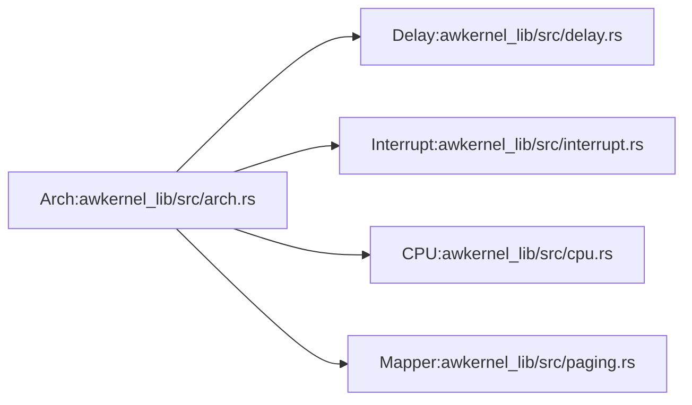

# Architecture Abstraction

Awkernel abstracts the architecture-specific details of the underlying hardware using the `Arch` trait,
which is defined in the [awkernel_lib/src/arch.rs](https://github.com/tier4/awkernel/blob/main/awkernel_lib/src/arch.rs).
The `Arch` trait requires the `Delay`, `Interrupt`, `CPU`, and `Mapper` traits as follows.

```rust
#[allow(dead_code)]
#[cfg(not(feature = "std"))]
trait Arch:
    super::delay::Delay + super::interrupt::Interrupt + super::cpu::CPU + super::paging::Mapper
{
}

#[allow(dead_code)]
#[cfg(feature = "std")]
trait Arch: super::delay::Delay + super::interrupt::Interrupt + super::cpu::CPU {}
```



The `Delay` trait provides a way to wait for a certain amount of time and to get the time.
The `Interrupt` trait provides a way to enable and disable interrupts.
The `CPU` trait provides a way to get the current CPU ID.
The `Mapper` trait provides a way to map and unmap virtual memory regions.

For the `std` environment, the `Arch` trait does not require the `Mapper` trait because user space applications do not need to manage memory mappings.

# Implementation

## x86_64

For x86_64, the [`X86`:awkernel_lib/src/arch/x86_64.rs](https://github.com/tier4/awkernel/blob/main/awkernel_lib/src/arch/x86_64.rs) struct implements the `Arch` trait.
In addition, it implements the `Delay`, `Interrupt`, `CPU`, and `Mapper` traits as follows.

- `Delay`: [awkernel_lib/src/arch/x86_64/delay.rs](https://github.com/tier4/awkernel/blob/main/awkernel_lib/src/arch/x86_64/delay.rs)
- `Interrupt`: [awkernel_lib/src/arch/x86_64/interrupt.rs](https://github.com/tier4/awkernel/blob/main/awkernel_lib/src/arch/x86_64/interrupt.rs)
- `CPU`: [awkernel_lib/src/arch/x86_64/cpu.rs](https://github.com/tier4/awkernel/blob/main/awkernel_lib/src/arch/x86_64/cpu.rs)
- `Mapper`: [awkernel_lib/src/arch/x86_64/paging.rs](https://github.com/tier4/awkernel/blob/main/awkernel_lib/src/arch/x86_64/paging.rs)

## AArch64


For AArch64, the [`AArch64`:awkernel_lib/src/arch/aarch64.rs](https://github.com/tier4/awkernel/blob/main/awkernel_lib/src/arch/aarch64.rs) struct implements the `Arch` trait.
In addition, it implements the `Delay`, `Interrupt`, `CPU`, and `Mapper` traits as follows.

- `Delay`: [awkernel_lib/src/arch/aarch64/delay.rs](https://github.com/tier4/awkernel/blob/main/awkernel_lib/src/arch/aarch64/delay.rs)
- `Interrupt`: [awkernel_lib/src/arch/aarch64/interrupt.rs](https://github.com/tier4/awkernel/blob/main/awkernel_lib/src/arch/aarch64/interrupt.rs)
- `CPU`: [awkernel_lib/src/arch/aarch64/cpu.rs](https://github.com/tier4/awkernel/blob/main/awkernel_lib/src/arch/aarch64/cpu.rs)
- `Mapper`: [awkernel_lib/src/arch/aarch64/paging.rs](https://github.com/tier4/awkernel/blob/main/awkernel_lib/src/arch/aarch64/paging.rs)
