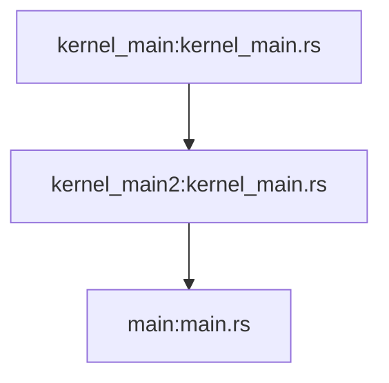
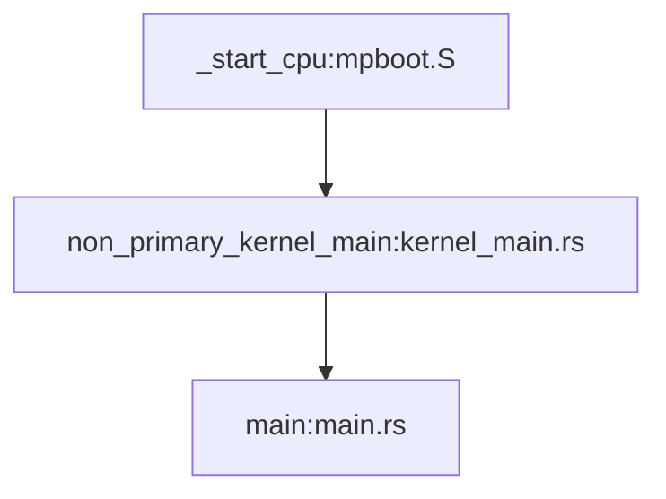
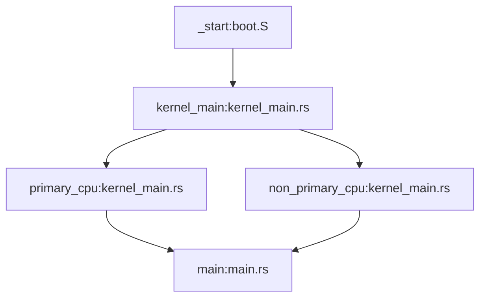
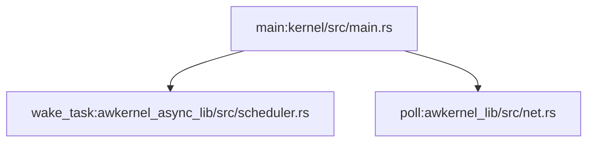
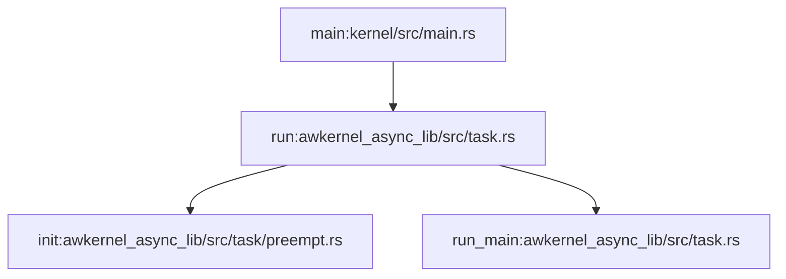

# Boot

In this section, we explain how Awkernel boots.

## x86_64

### Primary Core

The primary core calls `kernel_main` of `x86_64` first, which
is called by UEFI.

1. [`kernel_main`:kernel/src/arch/x86_64/kernel_main.rs](https://github.com/tier4/awkernel/blob/main/kernel/src/arch/x86_64/kernel_main.rs)
1. [`kernel_main2`:kernel/src/arch/x86_64/kernel_main.rs](https://github.com/tier4/awkernel/blob/main/kernel/src/arch/x86_64/kernel_main.rs)
2. [`main`:kernel/src/main.rs](https://github.com/tier4/awkernel/blob/main/kernel/src/main.rs)

During the primary core is booting,
it wakes up non-primary cores by sending ACPI's IPIs.

### Non-primary Cores

Non-primary cores calls `_start_cpu` defined in `mpboot.S` first, and it then calls `non_primary_kernel_main`.
It eventually calls `main` like the primary core.

1. [`_start_cpu`:kernel/asm/x86/mpboot.S](https://github.com/tier4/awkernel/blob/main/kernel/asm/x86/mpboot.S)
2. [`non_primary_kernel_main`:kernel/src/arch/x86_64/kernel_main.rs](https://github.com/tier4/awkernel/blob/main/kernel/src/arch/x86_64/kernel_main.rs)
3. [`main`:kernel/src/main.rs](https://github.com/tier4/awkernel/blob/main/kernel/src/main.rs)

## AArch64

### Primary and Non-primary Cores

`_start` defined in `boot.S` is the entry point for both the primary and non-primary cores.
`_start` eventually calls `kernel_main` in `kernel_main.rs`.
After that, the primary core calls `primary_cpu` and non-primary cores call `non_primary_cpu`.
Eventually, `main` is called.

1. [`_start`:kernel/asm/aarch64/boot.S](https://github.com/tier4/awkernel/blob/main/kernel/asm/aarch64/boot.S)
2. [`kernel_main`:kernel/src/arch/aarch64/kernel_main.rs](https://github.com/tier4/awkernel/blob/main/kernel/src/arch/aarch64/kernel_main.rs)
3. The primary core calls `primary_cpu` and non-primary cores call `non_primary_cpu`.
    1. [`primary_cpu`:kernel/src/arch/aarch64/kernel_main.rs](https://github.com/tier4/awkernel/blob/main/kernel/src/arch/aarch64/kernel_main.rs)
    2. [`non_primary_cpu`:kernel/src/arch/aarch64/kernel_main.rs](https://github.com/tier4/awkernel/blob/main/kernel/src/arch/aarch64/kernel_main.rs)
4. [`main`:kernel/src/main.rs](https://github.com/tier4/awkernel/blob/main/kernel/src/main.rs)

# Main Function

After booting, in the `main` function, the primary core wakes async/await tasks,
and non-primary cores execute async/await tasks.

## Primary Core

In `main` function, the primary core periodically calls
`wake_task` and `poll` functions defined in
`awkernel_async_lib` and `awkernel_lib`,

1. [`main`:kernel/src/main.rs](https://github.com/tier4/awkernel/blob/main/kernel/src/main.rs)
2. [`wake_task`:awkernel_async_lib/src/scheduler.rs](https://github.com/tier4/awkernel/blob/main/awkernel_async_lib/src/scheduler.rs)
3. [`poll`:awkernel_lib/src/net.rs](https://github.com/tier4/awkernel/blob/main/awkernel_lib/src/net.rs)

`wake_task` is a function to wake sleeping async/await tasks up,
and it will be explained in Sec. [Scheduler](./scheduler.md).
`poll` is a function to poll network interface controllers.
If some events arrives, `poll` wakes async/await tasks related to
the controllers.

## Non-primary Cores

In `main` function, non-primary core periodically call
`run` defined in `awkernel_async_lib`.
`run` initializes variables regarding preemption by calling `preempt::init`.
After that, it calls `run_main` to execute async/await tasks.

1. [`main`:kernel/src/main.rs](https://github.com/tier4/awkernel/blob/main/kernel/src/main.rs)
2. [`run`:awkernel_async_lib/src/task.rs](https://github.com/tier4/awkernel/blob/main/awkernel_async_lib/src/task.rs)
3. [`init`:awkernel_async_lib/src/task/preempt.rs](https://github.com/tier4/awkernel/blob/main/awkernel_async_lib/src/task/preempt.rs)
4. [`run_main`:awkernel_async_lib/src/task.rs](https://github.com/tier4/awkernel/blob/main/awkernel_async_lib/src/task.rs)

`run_main` executes async/await tasks,
and it will be explained in Sec. [Scheduler](./scheduler.md).
