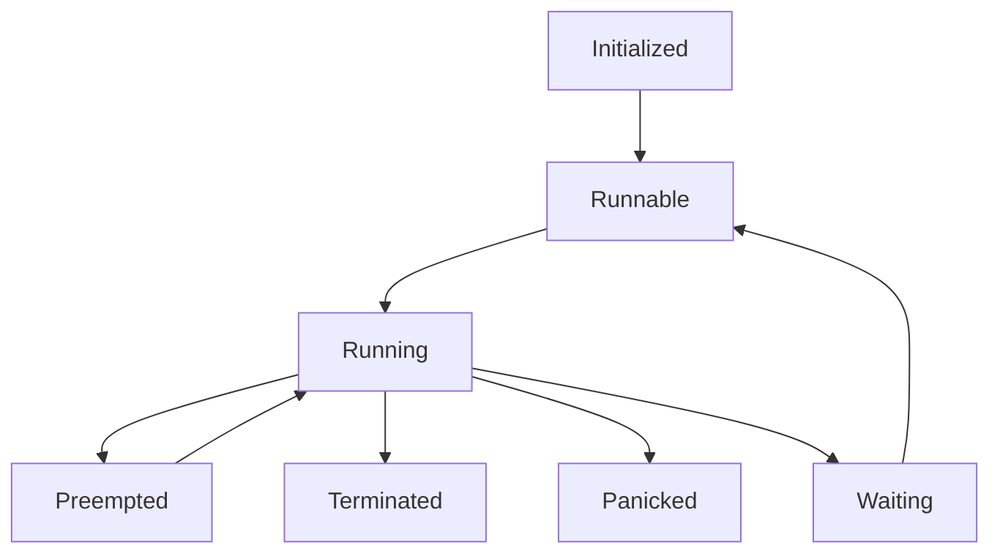

# Cooperative Multitasking

## Targets

- [awkernel_async_lib/src/task.rs](../../../../../awkernel_async_lib/src/task.rs).
- [awkernel_async_lib/src/scheduler/fifo.rs](../../../../../awkernel_async_lib/src/scheduler/fifo.rs).

## Subjects to be Verified

1. The scheduler is deadlock- and starvation-free.
2. If a task is awakened by other task, the task will be eventually executed.

## Result

```text
$ java -jar tla2tools.jar -workers `nproc` -config cooperative.cfg cooperative.tla
TLC2 Version 2.18 of 20 March 2023 (rev: 3ea3222)
Running breadth-first search Model-Checking with fp 87 and seed -6427394605603936974 with 16 workers on 16 cores with 14160MB heap and 64MB offheap memory [pid: 39893] (Linux 6.5.0-21-generic amd64, Private Build 19.0.2 x86_64, MSBDiskFPSet, DiskStateQueue).
Warning: symbols were renamed.
Parsing file /tmp/TLC.tla
Parsing file /tmp/Integers.tla
Parsing file /tmp/Sequences.tla
Parsing file /tmp/Naturals.tla
Parsing file /tmp/FiniteSets.tla
Semantic processing of module Naturals
Semantic processing of module Sequences
Semantic processing of module FiniteSets
Semantic processing of module TLC
Semantic processing of module Integers
Semantic processing of module cooperative
Starting... (2024-03-07 23:45:00)
Implied-temporal checking--satisfiability problem has 5 branches.
Computing initial states...
Finished computing initial states: 1 distinct state generated at 2024-03-07 23:45:01.
Checking 5 branches of temporal properties for the current state space with 209010 total distinct states at (2024-03-07 23:45:04)
Finished checking temporal properties in 01h 04min at 2024-03-08 00:49:47
Progress(130) at 2024-03-08 00:49:47: 79,666 states generated (79,666 s/min), 41,803 distinct states found (41,803 ds/min), 1,170 states left on queue.
Progress(178) at 2024-03-08 00:49:50: 171,137 states generated, 87,128 distinct states found, 0 states left on queue.
Checking 5 branches of temporal properties for the complete state space with 435640 total distinct states at (2024-03-08 00:49:50)
Finished checking temporal properties in 03h 00min at 2024-03-08 03:50:15
Model checking completed. No error has been found.
  Estimates of the probability that TLC did not check all reachable states
  because two distinct states had the same fingerprint:
  calculated (optimistic):  val = 4.0E-10
  based on the actual fingerprints:  val = 5.4E-9
171137 states generated, 87128 distinct states found, 0 states left on queue.
The depth of the complete state graph search is 178.
The average outdegree of the complete state graph is 1 (minimum is 0, the maximum 2 and the 95th percentile is 2).
Finished in 04h 05min at (2024-03-08 03:50:15)
```

## Variables

Variables are straightly defined as follows.

```
\* awkernel_async_lib::scheduler::fifo::FIFOData::queue
queue = <<>>;

\* lock variables
lock_info = [x \in 1..TASK_NUM |-> FALSE];
lock_future = [x \in 1..TASK_NUM |-> FALSE];
lock_scheduler = FALSE;

\* awkernel_async_lib::task::State
state = [x \in 1..TASK_NUM |-> "Initialized"];

is_terminated = [x \in 1..TASK_NUM |-> FALSE];

result_next = [x \in WORKERS |-> -1]; \* return value of get_next
result_future = [x \in WORKERS |-> ""]; \* return value of future

\* Does a task whose id > TASK_NUM \div 2 wakes nother task up?
wake_other = [x \in ((TASK_NUM \div 2) + 1)..TASK_NUM |-> FALSE];
```

`result_next` and `result_future` are variable to be stored of results of
`get_next` and `future` procedures, respectively.

Each entry of `state` must be `Initialized`, `Waiting`, `Runnable`, `Running`, `Panicked`,
or `Terminated`, as `task::State` defined in `task.rs`, as follows.
`Panicked` state is omitted in this verification
because it is almost equivalent to `Terminated`,
and `Preempted` state is also omitted because this verification is for cooperative multitask.

```rust
pub enum State {
    Initialized,
    Running,
    Runnable,
    Waiting,
    Preempted,
    Terminated,
    Panicked,
}
```



Note that this specification does not deal with `Panicked` and `Preempted` states.

## Starvation-free

The starvation-free can be verified as follows.

$$
\forall x \in 1..\mathrm{TASK\_NUM}: (\mathrm{state}[x] = \mathtt{Runnable} \leadsto \mathrm{state}[x] = \mathtt{Running})
$$

## Must be Awaken

The following paired tasks are prepared to verify that if a task is awakened by another task, the task will eventually be executed.

```rust
async fn task_a() {
    send_to_task_b().await;
    recv().await;
}

async fn task_b() {
    recv().await;
    send_to_task_b().await;
}
```

Tasks will awaken each other as follows.

```text
\* If there is 2 tasks, their task ID's are 1 and 2.
\* This future will execute as follows.
\*
\* step1: Task 2 wakes Task 1 up, and returns "Pending".
\* step2: Task 1 wakes Task 2 up, and returns "Ready".
\* step3: Task 2 returns "Ready".
\*
\* A task will become "Terminated", after returning "Ready".
procedure future(pid, task)
begin
    start_future:
        if task > TASK_NUM \div 2 then
            if wake_other[task] then
                call wake_task(task); \* to verify eventually_terminate

                set_result_future1: result_future[pid] := "Ready";
            else
                call wake_task(task - (TASK_NUM \div 2));

                set_result_future2:
                    wake_other[task] := TRUE;
                    result_future[pid] := "Pending";
            end if;
        else
            call wake_task(task + (TASK_NUM \div 2));
            set_result_future3: result_future[pid] := "Ready";
        end if;

    end_future:
        return;
end procedure;
```

Therefore, the 2nd subject can be verified as follows.

$$
\lozenge \forall x \in 1..\mathrm{TASK\_NUM}: (\mathrm{state}[x] = \mathtt{Terminated})
$$
