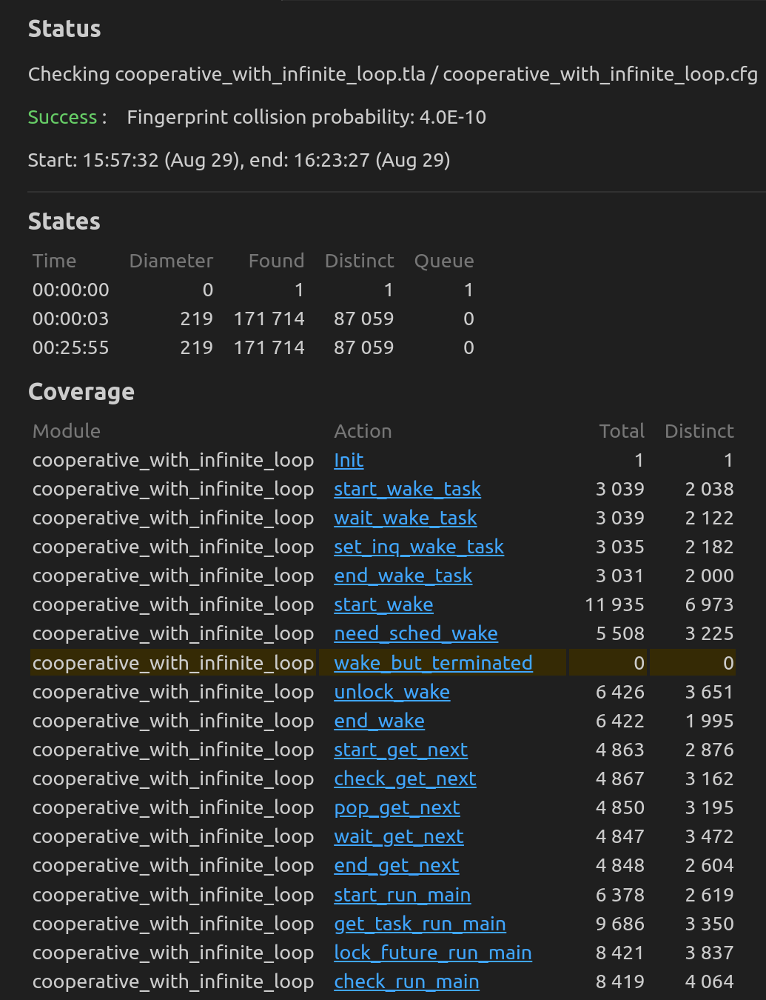

# Cooperative Multitasking

See [specification/awkernel_async_lib/src/tasl/cooperative/](../cooperative/) first, since the model is based on it.
The difference is that some tasks are supposed to include an infinite loop so that we can specify the following property.

## Targets

- [awkernel_async_lib/src/task.rs](../../../../../awkernel_async_lib/src/task.rs).
- [awkernel_async_lib/src/scheduler/fifo.rs](../../../../../awkernel_async_lib/src/scheduler/fifo.rs).

## Subjects to be Verified

1. When tasks are more than workers, all tasks will be eventually executes.

## Result

