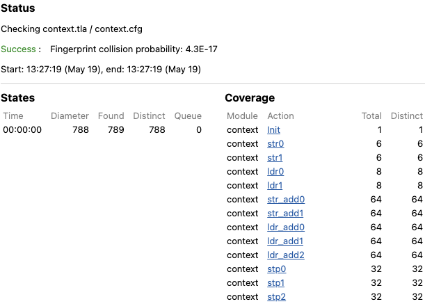

# AArch64 Exception Handler

## Target

[awkernel_lib/src/arch/aarch64/context.rs](../../../../../../awkernel_lib/src/arch/aarch64/context.rs).

## Subjects to be Verified

1. A context can be properly saved and restored.

## Result



## Detail

This specification is similar to [exception.tla](../../../../../kernel/asm/aarch64/exception.S/README.md).
Please see exception.tla before read this.

### Target Functions

`save_context` and `restore_context` are functions to save current context and restore it, respectively.
They are implemented in AArch64 assembly,
and specified by procedures in PlusCal.

The subject described above is verified as follows.

```
assert registers = ctx_start;
```

## Context

`Context`, which is a structure, defined in [awkernel_lib/src/arch/aarch64/context.rs](../../../../../../awkernel_lib/src/arch/aarch64/context.rs) can be represented by a sequence in TLA+
as follows.

```
[x \in 0..(SIZE_CONTEXT - 1) |-> 0]
```

`Context::gp_regs::x0` in Rust can be thus accessed as `Context[16 * 33]` in TLA+,
where `16 * 33` is the offset address.
