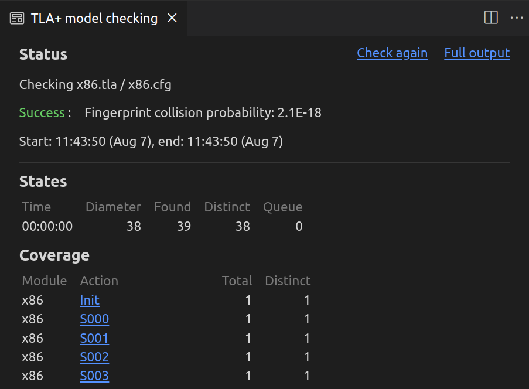

# x86 Exception Handler

## Target

awkernel_lib/src/context/x86.rs (to be filled)

## Subjects to be Verified

1. A context can be properly saved and restored.

## Result



## Detail

This specification is similar to [aarch64.tla](../aarch64/README.md).
Please see it beforehand.

### Target Functions

`save_context` and `restore_context` are functions to save current context and restore it, respectively.
They are implemented in x86 assembly (System V calling convension), and specified by procedures in PlusCal.

The subject described above is verified as follows.

```
assert registers = ctx_start;
```

## Context

`Context`, which is a structure, defined in awkernel_lib/src/context/x86.rs (to be filled) can be represented by a sequence in TLA+ as follows.

```
[x \in 0..(SIZE_CONTEXT - 1) |-> 0]
```
