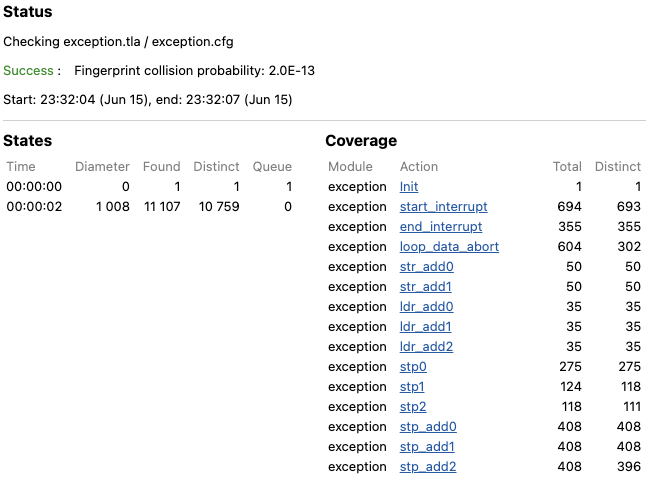

# AArch64 Exception Handler

## Target

[kernel/asm/aarch64/exception.S](../../../../../kernel/asm/aarch64/exception.S).

## Subjects to be Verified

1. A context can be properly restored when exiting the exception handler.
2. Condition 1 is satisfied even if exceptions occur recursively unless a data abort occurs.

## Prerequisite

1. x18 registers can be ignored because it is not used by the compiler.

## Result



## Detail


### The Exception Handler: `CALL_WITH_CONTEXT`

`CALL_WITH_CONTEXT` is the entry point of the exception handler as follows.

```
procedure CALL_WITH_CONTEXT()
variables
    ctx_start;
begin
    start_call_with_context:
        ctx_start := registers;

    \* omitted

    C_INT04: call interrupt(); \* recursive exception

    C17: call exception_restore_context();

    end_call_with_context:
        assert ctx_start = registers;
        counter := counter - 1;
        return;
end procedure;
```

`assert ctx_start = registers;` is an expression to verify the proposition 1.
Recursive exceptions indicated by the proposition 2 are represented as `call interrupt();`.

## Data Abort

If [r] is specified at of store or load and r is out of memory, then the data abort exception is occur as follows.

```
procedure data_abort_exception() begin
    loop_data_abort:
        data_abort := TRUE;
        goto loop_data_abort;
end procedure;
```

If a data abort occur, the verification will be stopped by the infinite loop.

## Recursive Exception

Exceptions can occur recursively, and it is represented as follows.

```
procedure interrupt() begin
    start_interrupt:
        either
            skip;
        or
            call CALL_WITH_CONTEXT();
        end either;

    end_interrupt:
        return;
end procedure;
```

### AArch64 Instructions and Representation in PlusCal/TLA+

- r, r1, r2: general purpose registers
- sys: system register
- imm: immediate value
- [r]: memory location of r

| AArch64           | PlusCal/TLA+               | Description   |
|-------------------|----------------------------|---------------|
| mov r1, r2        | macro mov(r1, r2)          | r1 = r2       |
| mrs r, sys        | macro mrs(r, sys)          | r = sys       |
| msr sys, r        | macro msr(sys, r)          | sys = r       |
| add r1, r2, imm   | macro add(r1, r2, imm)     | r1 = r2 + imm |
| sub r1, r2, imm   | macro sub(r1, r2, imm)     | r1 = r2 - imm |
| str r1, [r2, imm] | procedure str(r1, r2, imm) | [r2 + imm] = r1 |
| ldr r1, [r2, imm] | procedure ldr(r1, r2, imm) | r1 = [r2 + imm] |
| ldr r1, [r2], imm | procedure ldr_add(r1, r2, imm) | r1 = [r2]; r2 += imm |
| stp, r1, r2, [r3, imm] | procedure stp(r1, r2, r3, imm) | [r3 + imm] = r1; [r3 + imm + 8] = r2|
| ldp, r1, r2, [r3, imm] | procedure ldp(r1, r2, r3, imm) | r1 = [r3 + imm]; r2 = [r3 + imm + 8] |
| ldp, r1, r2, [r3], imm | procedure ldp_add(r1, r2, r3, imm) | r1 = [r3]; r2 = [r3 + 8]; r3 += imm |

## Registers

Registers can be represented as follows.

```
registers = [
    \* general purpose registers
    x0 |-> 0,
    x1 |-> 1,
    x2 |-> 2,

    \* omitted

    \* system registers
    elr |-> 200,
    esr |-> 201,
    spsr |-> 202,
    fpsr |-> 203,
    fpcr |-> 204,

    \* stack pointer
    sp |-> STACK_SIZE - 1
];
```

## Stack Memory

Stack memory can be represented as follows.

```
stack_memory = [x \in 0..(STACK_SIZE - 1) |-> <<>>];
```

## Handler

`procedure handler()` updates registers to verify the propositions above.
