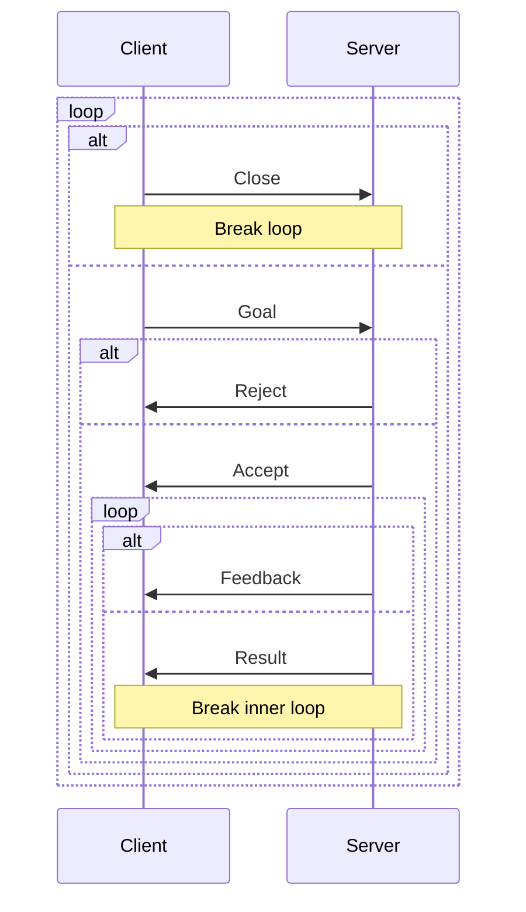
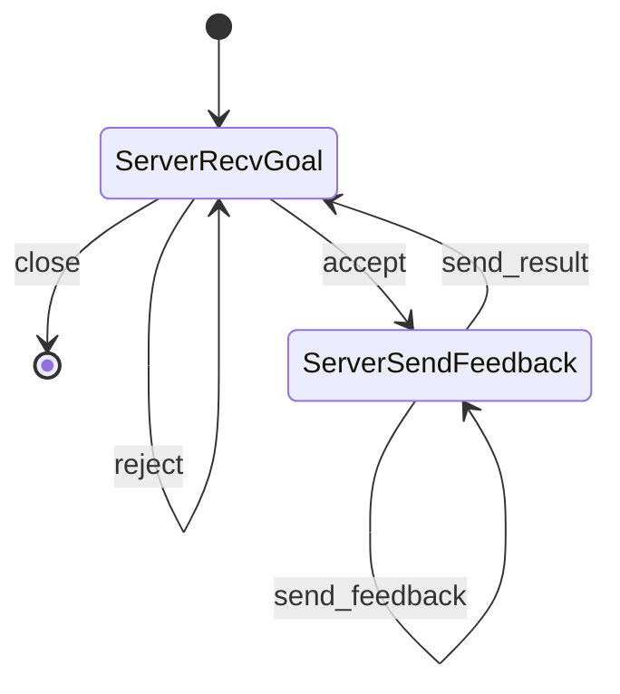
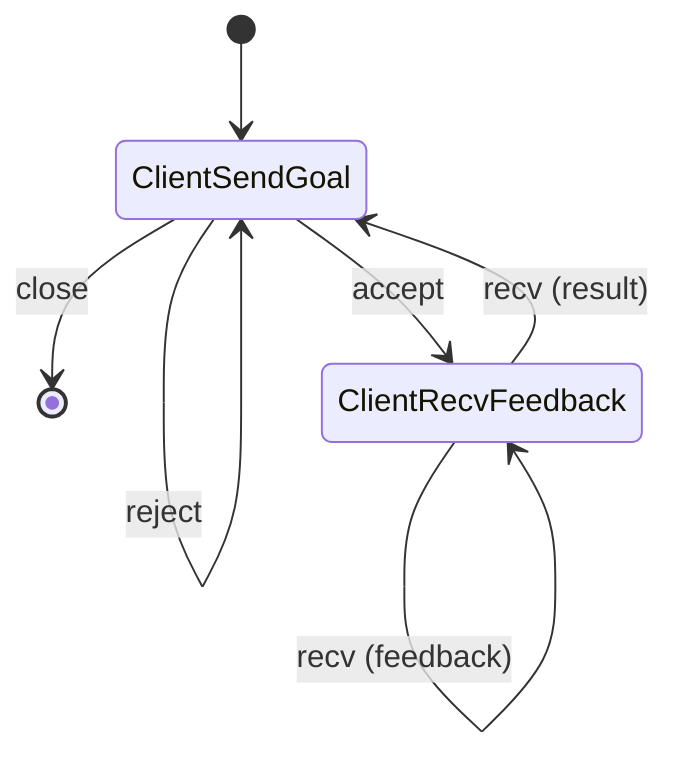

# Action Server and Client

The protocol of action server can be defined by session types as follows.
`G`, `F`, and `R` stand for the type of goal, feedback, and result, respectively.

```rust
type ProtoServer<G, F, R> = S::Rec<ProtoServerInn<G, F, R>>;
type ProtoServerInn<G, F, R> = S::Offer<S::Eps /* Close. */, ProtoServerGoal<G, F, R>>;
type ProtoServerGoal<G, F, R> = S::Recv<G /* Receive a goal. */, ProtoServerGoalResult<F, R>>;
type ProtoServerGoalResult<F, R> = S::Choose<
    S::Var<S::Z>, /* Reject. */
    S::Send<GoalResponse /* Send a response of the goal. */, ProtoServerFeedback<F, R>>,
>;
type ProtoServerFeedback<F, R> = S::Rec<ProtoServerFeedbackInn<F, R>>;
type ProtoServerFeedbackInn<F, R> = S::Choose<
    S::Send<F /* Send a feedback. */, S::Var<S::Z> /* Goto ProtoServerFeedbackInn. */>,
    S::Send<
        (ResultStatus, R),  /* Send a result. */
        S::Var<S::S<S::Z>>, /* Goto ProtoServerInn. */
    >,
>;
```

The protocol of action client is dual of this.

The protocol can be described in sequence diagram as follows.



## State Machine of Server

The state machine of action server is as follows.
This can be described by [action_server.tla](./action_server.tla) in TLA+.



## State Machine of Client

The state machine of action client is as follows.
This can be described by [action_client.tla](./action_client.tla) in TLA+.


